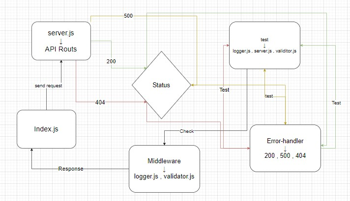

# api-server
## lab4
### lab steps :
+ creat new repo.
+ create node workflow from action at github .
+ clone the repo .
+ create package.json and some files folders(tests ,src )and files(.env,index.js,readme.md )at the src folder (error-handlers and middleware and server.js)at tests(logger.test.js and server.test.js).
+ install some libraly as express, dotenve ,jest, supertest.and create DB then write the correct content in the files
go to herouko and deploy once for the main branch and other for div branch
[pull request](https://github.com/sbkhaloof/api-server/pull/1)

[heroku link](https://api-server-siham.herokuapp.com/)
